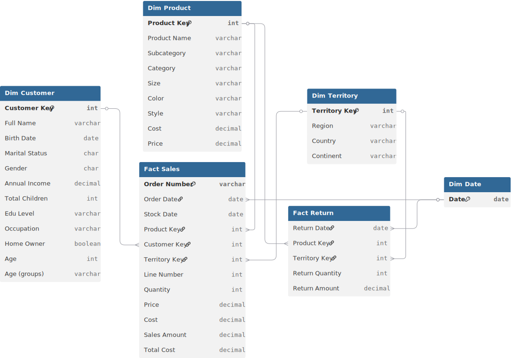

# 📊 Project Background: TurboFront Post-pandemic Sales Growth Analytics

**TurboFront** is a global leader in high-performance cycling equipment and components. Historically known for equipping professional racing teams, the company faced an existential crisis during the 2020 pandemic as competitive events were cancelled worldwide. In a strategic pivot, TurboFront shifted its focus to **"Urban Resilience"**,targeting the booming market of commuters and fitness enthusiasts seeking alternatives to public transit.

This project analyzes a comprehensive dataset spanning **2020–2022**, capturing the company's turbulent transition. As a Lead Data Analyst, my objective was to evaluate the success of this pivot, identify regional growth engines, and diagnose the "Profit Leaks" hidden within the company's **$24.9 Million** revenue stream. The goal is to provide a data-driven roadmap for the post-pandemic era, moving from reactive survival to proactive market dominance.

Insights and recommendations are provided on the following key areas:

* **The "Pandemic Pivot" Trajectory** (Revenue Velocity & Year-over-Year Growth)
* **Regional Powerhouses** (The Rise of the Australian Market)
* **Product Mix Optimization** (Balancing High-Volume Accessories vs. High-Margin Bikes)
* **The Return Leakage** (Plugging the Value Drain in High-Ticket Items)

https://github.com/user-attachments/assets/1f0313e2-69da-4655-8ab9-be12a88e4369

**PowerQuery M Code regarding data preparation process of various tables can be found [[here]](https://github.com/mehedibhai101/After-pandemic_Sales_Growth_Analysis/tree/main/Data%20Cleaning).**

**DAX queries regarding various analytical calculations can be found [[here]](https://github.com/mehedibhai101/After-pandemic_Sales_Growth_Analysis/tree/main/DAX%20Calculations).**

**An interactive Power BI dashboard used to report and explore sales trends can be found [[here]](https://app.powerbi.com/view?r=eyJrIjoiMWZkNzNlNmQtNWQ4YS00NzEzLWI4NDEtNjE0ZjNhMzkyYmVkIiwidCI6IjAwMGY1Mjk5LWU2YTUtNDYxNi1hNTI4LWJjZTNlNGUyYjk4ZCIsImMiOjEwfQ%3D%3D).**

---

# 🏗️ Data Structure & Initial Checks

The TurboFront analytics engine is built on a robust **Star Schema**, integrating sales, returns, and customer data to provide a 360-degree view of the business.

* **`Fact_Sales`:** The central transaction registry containing **56,000+ records**, tracking `OrderQuantity`, `UnitPrice`, and `ProductKey` across 2020–2022.
* **`Dim_Products`:** A detailed catalog of **397 SKUs**, including hierarchy data (Category, Subcategory) and cost/price metrics.
* **`Dim_Customers`:** Profiles for **18,000+ customers**, including demographic details like `Occupation`, `Education`, and `HomeOwnerFlag`.
* **`Dim_Territory`:** Geographic segmentation covering **10 sales territories** across North America, Europe, and the Pacific.
* **`Fact_Returns`:** A critical table tracking returned items, essential for calculating the **Return Rate** and identifying quality control issues.

### 🗺️ Entity Relationship Diagram (ERD)


---

# 📋 Executive Summary

### Overview of Findings

TurboFront has successfully navigated the pandemic, generating **$24.9M in Total Revenue** and **$10.5M in Profit**. However, the growth is uneven. While **2021 saw a massive surge**, 2022 data indicates a potential plateau, suggesting the initial "bike boom" demand is softening. The business is heavily reliant on the **Bikes category**, which drives revenue but also carries the highest operational risk due to returns. A critical "Retention Gap" exists, with a low repeat purchase rate indicating that the influx of new pandemic customers is not converting into long-term loyalists.


---

# 🔍 Insights Deep Dive

### 📈 The "Pandemic Pivot" Trajectory

* **The 2021 Surge.** Revenue skyrocketed in 2021, driven by the global shift towards outdoor activities. The data shows a clear spike in Q2 and Q3 2021, validating the "Urban Resilience" strategy.
* **The 2022 Plateau.** Early 2022 performance shows a stabilization of the trend. Monthly revenue run rates have leveled off, signaling the need for new growth catalysts beyond the initial pandemic demand.
* **Volume vs. Value.** While order volume increased, the **Average Order Value (AOV)** remained relatively stable, suggesting the growth was driven by acquiring *new* customers rather than upselling existing ones.


### 🌏 Regional Powerhouses

* **US Dominance.** The **United States** remains the primary revenue engine, contributing the largest share of global sales. The **Southwest** and **Northwest** territories are particularly strong performers.
* **The Australian Opportunity.** **Australia** has emerged as a high-growth secondary market. Despite a smaller population, the revenue density in this region is high, indicating a strong product-market fit for TurboFront's high-end commuter gear.
* **European Lag.** Compared to the US and Pacific markets, **European territories (France, Germany, UK)** show slower growth rates, potentially due to stiffer local competition or supply chain bottlenecks.


### 🚲 Product Mix Optimization

* **The "Bikes" Revenue Engine.** The **Bikes** category is the undisputed heavyweight, generating the vast majority of revenue. Mountain and Road bikes are the top-selling subcategories.
* **The "Accessories" Volume Driver.** While **Accessories** (Helmets, Tires, Bottles) contribute less to total revenue, they account for the highest *volume* of transactions. These items act as the entry point for many customers.
* **Clothing Underperformance.** The **Clothing** category (Jerseys, Shorts) lags behind in both volume and revenue, representing a significant missed cross-selling opportunity given the high attachment potential with bike sales.


### 📉 The Return Leakage

* **The 2.2% Friction.** The overall **Return Rate** sits at approximately **2.2%**. While this seems low, for high-ticket items like Bikes, it represents a significant erosion of profit margin.
* **Shorts & Sizing Issues.** Within the Clothing category, **Shorts** have a disproportionately high return rate, pointing to potential sizing inconsistencies or poor online fit guides.
* **Component Compatibility.** Certain high-end components show elevated return rates, likely due to customers purchasing incompatible parts for DIY repairs. This "Education Gap" is costing the company in logistics and restocking fees.


---

# 🚀 Recommendations:

Based on the insights and findings above, we recommend the TurboFront leadership team consider the following:

* **Launch "Turbo-Loyalty":** Address the retention gap by implementing a points-based loyalty program. Reward the thousands of 2021 bike buyers for returning to purchase **Accessories and Clothing**.
* **The "Fit-First" Initiative:** To tackle the high return rate in Clothing (specifically Shorts), implement a "True-Fit" sizing tool on the e-commerce platform and audit the sizing charts for accuracy.
* **Australian Expansion:** Double down on the **Australian market** with targeted marketing campaigns and optimized inventory distribution centers to capitalize on the high revenue density.
* **"Bundle & Save" Strategy:** Increase the AOV by creating **"Commuter Bundles"** (Bike + Helmet + Lock + Lights) to encourage multi-category purchasing and clear Accessory inventory.
* **Dynamic Inventory Rebalancing:** Shift inventory allocation from the slower-growth European hubs to the high-velocity US Southwest and Australian warehouses to prevent stockouts during peak seasons.

---

## ⚠️ Assumptions and Caveats:

Throughout the analysis, multiple assumptions were made to manage challenges with the data:

* **Partial 2022 Data:** The dataset spans 2020–2022. It is assumed that 2022 data is partial or represents the "current" year for the purpose of the analysis.
* **Return Mapping:** Returns are mapped to the original sales transaction date for rate calculations, assuming a standard 30-day return window policy.

---

## 📂 Repository Structure

```
Annual_Sales_Analytics_Report/
│
├── Dashboard/                            # Final visualization and reporting outputs
│   ├── assets/                           # Visual elements used in reports (logos, icons, etc.)
│   │   ├── Icons/                        # Collection of icons used in KPI Cards/Buttons
│   │   │   ├── Button Icons/
│   │   │   │   ├── Navigation/
│   │   │   │   └── Others/
│   │   │   ├── Formatting Icons/
│   │   │   └── KPI Icons/
│   │   ├── Background.png                # The background image used throughout the dashboard
│   │   └── Theme.json                    # Custom Power BI color palette for dashboard
│   ├── live_dashboard.md                 # Links to hosted Power BI Service report
│   └── static_overview.pdf               # Exported PDF version of the final dashboard for quick viewing
│
├── Data Cleaning/                        # Power Query M Codes for cleaning tables of the dataset.
│
├── Dataset/                              # The data foundation of the project
│   ├── entity_relationship_diagram.svg   # Visual map of table connections and cardinality
│   ├── Sales Data/
│   │   ├── TurboFront 2020 Sales.csv
│   │   ├── TurboFront 2021 Sales.csv
│   │   └── TurboFront 2022 Sales.csv
│   ├── Categories Lookup.csv
│   ├── Customer Lookup.csv
│   ├── Subcategories Lookup.csv
│   ├── Territory Lookup.csv
│   ├── TurboFront Products.csv
│   └── TurboFront Returns.csv
│
├── DAX Calculations/                     # Business logic and analytical formulas
│   ├── calculated_column.md              # Definitions for static row-level logic (e.g., hour buckets)
│   └── measures.md                       # Dynamic aggregation formulas (e.g., Total Revenue, MoM Growth)
│
├── LICENSE                               # Legal terms for code and data usage
└── README.md                             # Project background, summary and key insights
``` 

---

## 🛡️ License

This project is licensed under the [MIT License](LICENSE). You are free to use, modify, and distribute it with proper attribution.

---

## 🌟 About Me

Hi! I’m **Mehedi Hasan**, well known as **Mehedi Bhai**, a Certified Data Analyst with strong proficiency in *Excel*, *Power BI*, and *SQL*. I specialize in data visualization, transforming raw data into clear, meaningful insights that help businesses make impactful data-driven decisions.

Let’s connect:

[](https://www.linkedin.com/in/mehedi-hasan-b3370130a/)
[](https://youtube.com/@mehedibro101?si=huk7eZ05dOwHTs1-)
